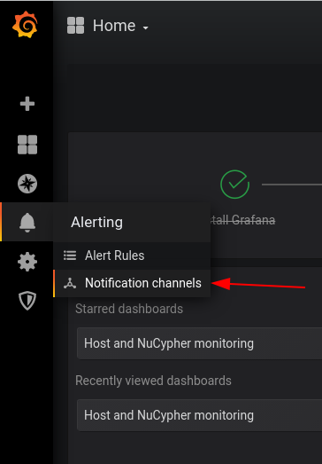
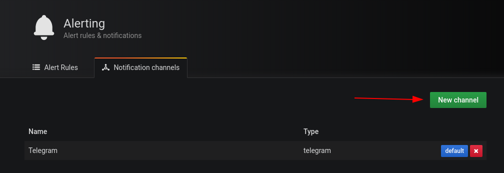
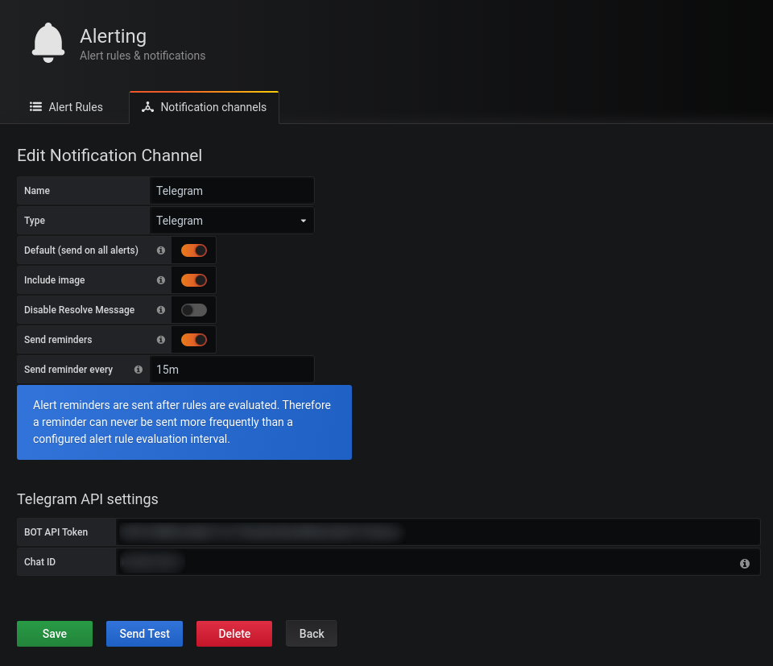

# README

## Disclaimer

This guide was wrote for persons who complete NuCypher installation guide using [SystemD service installation](https://docs.nucypher.com/en/latest/guides/installation_guide.html#systemd-service-installation).  
The guide was tested on Ubuntu 18.04 and should be applicable to all deb-based distributions.

## Pre-Installation

1. Clone repo

    ```shell
    git clone https://github.com/p2p-org/nucypher-monitoring.git
    ```

## Installation

1. Install docker and docker-compose if you didn't it before.

    ```shell
    curl -fsSL https://get.docker.com -o- | sh

    curl -fsSL https://github.com/docker/compose/releases/download/1.25.0/docker-compose-`uname -s`-`uname -m` -o /usr/local/bin/docker-compose && \
    chmod +x /usr/local/bin/docker-compose && \
    ln -s /usr/local/bin/docker-compose /usr/bin/docker-compose && \
    curl -fsSL https://raw.githubusercontent.com/docker/compose/1.25.0/contrib/completion/bash/docker-compose -o /etc/bash_completion.d/docker-compose
    ```

2. Install node-exporter, set listening address to `127.0.0.1` and enable expose systemd metrics.
You can use bash-script `install-prometheus-node-exporter.sh` for automated install. Don't forget execute it from root user.

    ```shell
    ./install-prometheus-node-exporter.sh
    ```

## Launching

1. Run docker-compose (replace `1.1.1.1` with your server's external address or DNS name for correct url in alert messages).

    ```shell
    GRAFANA_EXTERNAL_IP="1.1.1.1" docker-compose up -d
    ```

## Configure alert channels

### Telegram

1. Get token by telegram bot [guide](https://core.telegram.org/bots#6-botfather) and your chat id (You can get it by @get_id_bot or any other way you know how);
2. Go to grafana `Alerting` -> `Notification channels`;

    

3. Click on `New channel` button;

    

4. Select `Type` -> `Telegram`;
5. Fill `Name`, paste your bot token to `BOT API Token` field and your chat id to `Chat ID` field. Click on `Send Test` to check the sending of alerts and if it's OK click on `Save` button;
6. Additionally you can set another options for including image  into messages, send reminders, etc. Like on screenshot below.

    

### OpsGenie

1. Get API key by [OpsGenie documentation](https://docs.opsgenie.com/docs/api-key-management);
2. Repeat items 1,2,3 list above;
4. Select `Type` -> `OpsGenie`
5. Fill `Name`, paste your API key to `API key`. Click on `Send Test` to check the sending of alerts and if it's OK click on `Save` button;
